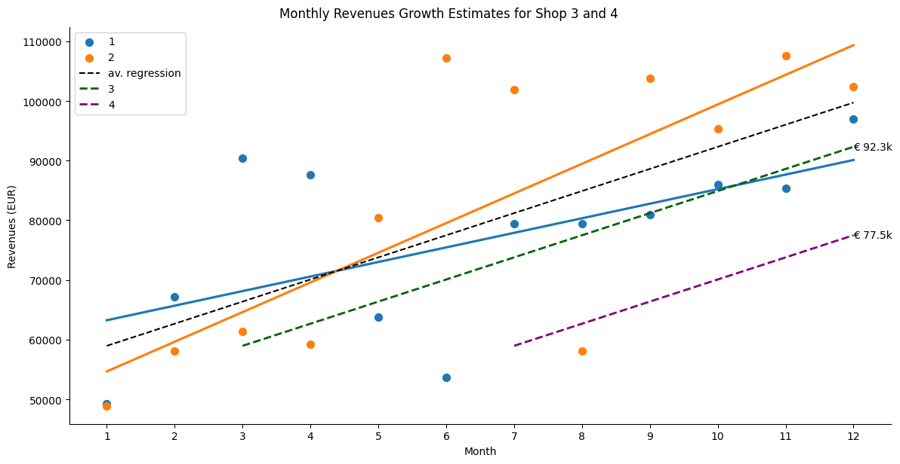
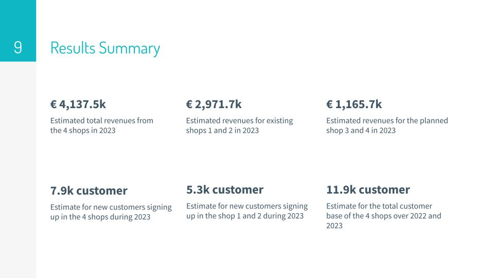

# Revenue Growth Forecasting Analysis for Online Retail Shop Chain

A case study of estimating revenue growth of a chain of retail shops based on the revenue and customer data provided from the previous year.

# Analysis Scope

In this study, revenue and customer data is provided from two retail shops in 2022. The goal is to estimate the revenue and the new number of customers in those shops during 2023. Furthermore, The data is used to forecast the same metrics for two new shops which are planned to be launched during in March and July 2023.

# Assumptions

- Both shops started in 01.01.2022. Therefore, customer IDs that appear for the first time in the dataset are considered new customers
- That the growth rates in monthly revenue and new customers for both shops will continue into 2023 at the same rate as 2022
- To simplify the analysis, we assume there are no boundaries for continuous growth (such as resources and capacity)
- The planned new shops in 2023 will have both identical growth behavior to the regression average of shop 1 and 2 in 2022
- For simplification, all data points will be included in regression calculations and no data points will be considered an outlier

# Approach

- The forecasting is performed arithmetically, where growth trends of revenue and customer numbers are tracked in 2022 and extrapolated to 2023
- Regression will be based on monthly metrics (revenue and new customers) of the shop, regardless the number of orders in each month

# Analysis

The complete analysis is provided in the [Jupyter Notebook file](revenue_forecasting.ipynb)

# Analysis results
The analysis results are presented in the [PDF slides](Analysis Results.pdf)

# Results Summary

- Revenues for shop 1 and 2 in 2023 are estimated at € 2,971.7k
- Revenues for the planned shop 3 and 4 in 2023 are estimated at € 1,165.7k
- The total customer base of the 4 shops over 2022 and 2023 is estimated to reach 11.9k customer
- Total 2023 revenues from the 4 shops are estimated at € 4,137.5k
- An estimate of 7.9k new customers are expected to sign up in the 4 shops during 2023
